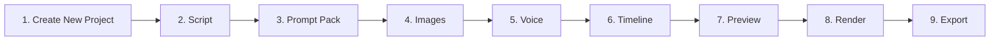

# PIPELINE WORKFLOW — AI DOCUMENTARY STUDIO

## 9-Step Sequential Production Pipeline

---

## Detailed Stage Documentation

### 1. Create New Project
- **User Action**: Click `+ Create Project` in header toolbar or dashboard card.
- **System Action**: Instantiates new project container with initial parameters and navigates directly to Stage 2 (Script Engine).

### 2. Script
- **User Action**: Enter documentary topic / core concept and select narrative tone (Dramatic History, True Crime, Science).
- **System Action**: Formulates multi-scene documentary narration script breakdown.

### 3. Prompt Pack
- **User Action**: Choose visual art style preset (Cinematic 35mm, Renaissance, Hyperrealistic).
- **System Action**: Auto-formulates AI image generation prompts mapped to each scene text segment.

### 4. Images
- **User Action**: Review and trigger AI image generation for scene visual clips.
- **System Action**: Synthesizes 16:9 / 9:16 visual assets per scene.

### 5. Voice
- **User Action**: Select neural voice narrator (Deep British Male, American Reporter, British Female).
- **System Action**: Synthesizes neural TTS voiceover audio file.

### 6. Timeline
- **User Action**: Arrange visual clips, voiceover narration, background music, and subtitles across multi-track timeline compositor.
- **System Action**: Synchronizes clip timings and audio waveforms.

### 7. Preview
- **User Action**: Click `▶ Preview`.
- **System Action**: Opens real-time documentary video player modal for review.

### 8. Render
- **User Action**: Click `⚡ Render`.
- **System Action**: Executes multi-threaded video stream compilation with real-time progress bar.

### 9. Export
- **User Action**: Click `⬇ Export`.
- **System Action**: Downloads and saves high-definition MP4 file (4K Ultra HD, 60 FPS).
