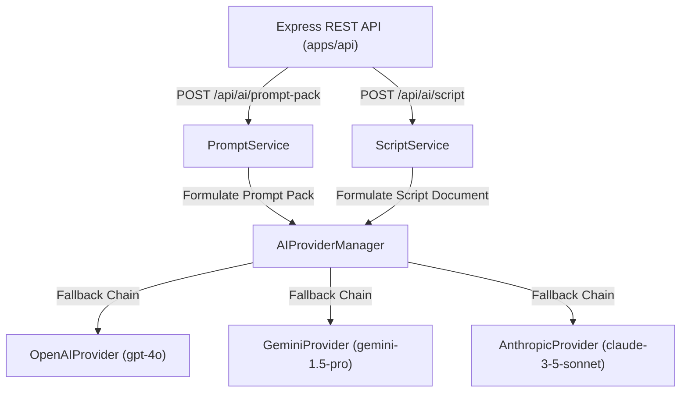
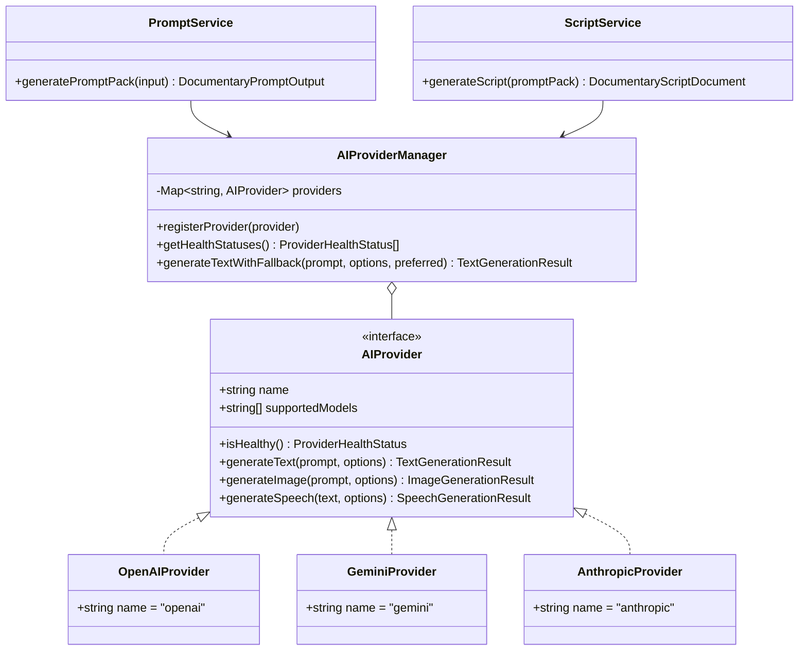

# SPRINT 2 REPORT — AI ORCHESTRATION LAYER

## Executive Summary
In Sprint 2, the hardcoded UI strings in the Script Engine and Prompt Pack were replaced with a backend **AI Orchestration Layer** in `packages/core/src/ai/` and REST API endpoints in `apps/api`. No UI changes or FFmpeg rendering code were modified.

---

## 1. System Architecture Diagram



---

## 2. Class Diagram



---

## 3. Directory & File Structure

```text
packages/core/src/ai/
├── ai-provider.ts                  # Core AIProvider interface & data contracts
├── ai-provider-manager.ts          # Provider registry, fallback chain, health checks, timeouts, retries
├── prompt-service.ts               # Structured documentary prompt pack generation service
├── script-service.ts               # Structured documentary script document generation service
├── adapters/
│   ├── openai-provider.ts          # OpenAI AIProvider adapter
│   ├── gemini-provider.ts          # Gemini AIProvider adapter
│   └── anthropic-provider.ts       # Anthropic AIProvider adapter
└── index.ts                        # Module re-exports

apps/api/src/
├── controllers/
│   └── aiController.ts             # AI REST controller handlers
└── routes/
    └── ai.ts                       # POST /api/ai/prompt-pack & POST /api/ai/script
```

---

## 4. REST API Endpoint Specifications

### `POST /api/ai/prompt-pack`
- **Request Body**:
  ```json
  {
    "topic": "Rise and Fall of Ancient Carthage",
    "tone": "Dramatic History",
    "language": "en",
    "preferredProvider": "openai"
  }
  ```
- **Response HTTP 200 OK**:
  ```json
  {
    "success": true,
    "data": {
      "topic": "Rise and Fall of Ancient Carthage",
      "tone": "Dramatic History",
      "language": "en",
      "narrativeStructure": {
        "hook": "In the shadow of historical archives, the secret story of Rise and Fall of Ancient Carthage was lost to time...",
        "thesis": "Power, ambition, and strategic warfare defined the transformation of Rise and Fall of Ancient Carthage.",
        "climax": "The fateful turning point where the outcome of Rise and Fall of Ancient Carthage hung in the balance.",
        "resolution": "How the legacy of Rise and Fall of Ancient Carthage echoes in modern civilization."
      },
      "globalStyleRules": {
        "visualPreset": "Dramatic History Cinematic 35mm Film Grain",
        "aspectRatio": "16:9",
        "colorPalette": "Deep Amber, Shadowed Bronze, Muted Crimson"
      },
      "scenePrompts": [
        {
          "sceneIndex": 1,
          "title": "Scene 1: Dawn of Rise and Fall of Ancient Carthage",
          "visualConcept": "Wide establishing shot of landscape during the era of Rise and Fall of Ancient Carthage",
          "imagePrompt": "Wide cinematic establishing shot of Rise and Fall of Ancient Carthage, dramatic volumetric golden hour sunlight, 35mm film texture, hyperrealistic documentary composition, 8k resolution",
          "suggestedArtStyle": "Cinematic Archival",
          "cameraMotionPreset": "SLOW_ZOOM_IN"
        }
      ],
      "providerUsed": "openai",
      "generatedAt": "2026-07-22T13:26:23.153Z"
    }
  }
  ```

---

### `POST /api/ai/script`
- **Request Body**:
  ```json
  {
    "topic": "Rise and Fall of Ancient Carthage",
    "tone": "Dramatic History",
    "language": "en"
  }
  ```
- **Response HTTP 200 OK**:
  ```json
  {
    "success": true,
    "data": {
      "id": "script-1784726783170",
      "topic": "Rise and Fall of Ancient Carthage",
      "tone": "Dramatic History",
      "language": "en",
      "totalDurationMs": 45000,
      "scenes": [
        {
          "sceneIndex": 1,
          "title": "Scene 1: Dawn of Rise and Fall of Ancient Carthage",
          "summary": "Wide establishing shot of landscape during the era of Rise and Fall of Ancient Carthage",
          "startTimeMs": 0,
          "durationMs": 15000,
          "narrationCues": [
            {
              "id": "narr-script-1784726783170-1",
              "sceneIndex": 1,
              "speaker": "Historian Narrator",
              "text": "Scene 1: Scene 1: Dawn of Rise and Fall of Ancient Carthage. In this pivotal chapter of Rise and Fall of Ancient Carthage, history was dramatically rewritten.",
              "startTimeMs": 0,
              "durationMs": 15000
            }
          ],
          "imagePrompts": [
            {
              "id": "img-script-1784726783170-1",
              "sceneIndex": 1,
              "prompt": "Wide cinematic establishing shot of Rise and Fall of Ancient Carthage...",
              "artStyle": "Cinematic Archival",
              "aspectRatio": "16:9"
            }
          ],
          "voiceCues": [
            {
              "id": "voice-script-1784726783170-1",
              "sceneIndex": 1,
              "voiceId": "deep-british-male",
              "narratorType": "Historical Narrator",
              "speedMultiplier": 1,
              "pitchAdjustment": 0
            }
          ]
        }
      ],
      "timelineMarkers": [
        {
          "id": "mark-script-1784726783170-1",
          "timeMs": 0,
          "label": "Scene 1: Dawn of Rise and Fall of Ancient Carthage",
          "markerType": "CHAPTER_START"
        }
      ],
      "subtitleCues": [
        {
          "id": "sub-narr-script-1784726783170-1",
          "startTimeMs": 0,
          "endTimeMs": 15000,
          "text": "Scene 1: Scene 1: Dawn of Rise and Fall of Ancient Carthage. In this pivotal chapter..."
        }
      ],
      "metadata": {
        "providerUsed": "openai",
        "generatedAt": "2026-07-22T13:26:23.171Z",
        "version": 1
      }
    }
  }
  ```

---

## 5. Summary Verdict
**SPRINT 2 COMPLETE — AI ORCHESTRATION LAYER IMPLEMENTED**
Hardcoded UI strings are replaced with a backend service architecture supporting multi-provider fallback (`OpenAI` ➔ `Gemini` ➔ `Anthropic`), health monitoring, timeouts, and retries.
