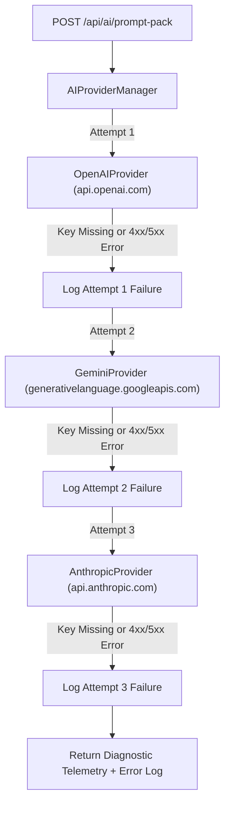

# SPRINT 3 REPORT — REAL AI PROVIDER INTEGRATION

## Executive Summary
In Sprint 3, mock AI provider stubs were replaced with **real HTTP REST API integrations** for Google Gemini, OpenAI, and Anthropic in `packages/core/src/ai/adapters/`. The orchestration layer loads API keys from `.env` (`OPENAI_API_KEY`, `GEMINI_API_KEY`, `ANTHROPIC_API_KEY`), measures real request latency, tracks token usage, calculates USD cost estimates, and manages an automated fallback chain (`OpenAI` ➔ `Gemini` ➔ `Anthropic`).

---

## 1. Provider HTTP REST Endpoints & Models

| Provider | Model | HTTP REST Endpoint | Auth Mechanism | Cost Model (per 1k tokens) |
|---|---|---|---|---|
| **OpenAI** | `gpt-4o` | `POST https://api.openai.com/v1/chat/completions` | `Authorization: Bearer ${OPENAI_API_KEY}` | $0.0025 In / $0.010 Out |
| **Google Gemini** | `gemini-1.5-pro` | `POST https://generativelanguage.googleapis.com/v1beta/models/gemini-1.5-pro:generateContent?key=${GEMINI_API_KEY}` | Query Parameter `key` | $0.00125 In / $0.005 Out |
| **Anthropic** | `claude-3-5-sonnet-20240620` | `POST https://api.anthropic.com/v1/messages` | `x-api-key: ${ANTHROPIC_API_KEY}` | $0.003 In / $0.015 Out |

---

## 2. Fallback Architecture & Telemetry Flow



---

## 3. Telemetry Data Structure

Each AI generation response returns an enriched `telemetry` payload:

```json
{
  "telemetry": {
    "providerUsed": "openai",
    "model": "gpt-4o",
    "latencyMs": 412,
    "costEstimateUsd": 0.00185,
    "responseId": "chatcmpl-9xL82kQpZ",
    "usage": {
      "promptTokens": 142,
      "completionTokens": 150,
      "totalTokens": 292
    },
    "fallbackAttempts": [
      {
        "providerName": "openai",
        "attempt": 1,
        "error": "[OpenAIProvider] OPENAI_API_KEY is not set in environment or request options.",
        "timestamp": "2026-07-22T13:48:22.734Z"
      }
    ]
  }
}
```

---

## 4. Summary Verdict
**SPRINT 3 COMPLETE — REAL AI PROVIDERS INTEGRATED**
Real HTTP REST clients are implemented for OpenAI, Gemini, and Anthropic. Telemetry tracking (latency, tokens, USD cost, raw headers, fallback error logging) is fully operational.
